# TRABALHO 01:  EADica
Trabalho desenvolvido durante a disciplina de BD1

# Sumário

### 1. COMPONENTES 
Integrantes do grupo 
Aline Bravin Prasser: aline_bravin@hotmail.com 
Luara Hombre Sathler: luara.hombres@gmail.com 

### 2.INTRODUÇÃO E MOTIVAÇÃO 
Este documento contém a especificação do projeto do banco de dados EADica
 e motivação da escolha realizada.  

> A instituição de ensino online "EADica" visa criar um ambiente onde os usuários podem consumir aulas de forma dinâmica e, ao final de cada curso, sejam recompensados com um certificado que comprove a sua capacitação no assunto que desejar. Tendo em vista as dificuldades geradas por causa da atual pandemia de Covid-19, "EADica" é uma alternativa àqueles que gostariam de aprender ou aprimorar seu conhecimento em cursos que abrangem diversas áreas. Para atender suas demandas, a empresa precisa de um sistema que armazene os dados dos Usuários, Instrutores e Cursos, além de armazenar as informações do aluno e professor em relação a seus respectivos cursos. Ademais, o sistema deverá permitir que o usuário assista as vídeo-aulas, possa ver seu progresso no curso e receba o seu certificado de conclusão e que os instrutores publiquem seus cursos.

### 3.MINI-MUNDO 

Descrever o mini-mundo! (Não deve ser maior do que 30 linhas, se necessário resumir para justar)  
Entrevista com o usuário e identificação dos requisitos.(quando for o caso de sistemas com cliente  real) 
Descrição textual das regras de negócio definidas como um  subconjunto do mundo real 
cujos elementos são propriedades que desejamos incluir, processar, armazenar, 
gerenciar, atualizar, e que descrevem a proposta/solução a ser desenvolvida.

> Uma instituição de ensino a distância deseja um sistema de informação para gerenciar suas atividades e prover cursos online. 
Dos alunos serão armazenadas informações como nome, cpf, email, matrícula e senha de acesso ao sistema. 
Dos cursos serão armazenados o nome, categoria (tecnologia, biologia, matemática, filosofia...), tempo de duração, descrição e certificado de conclusão. 
Cada aluno pode estar inscrito em nenhum ou vários cursos ao mesmo tempo, enquanto um curso precisa ter pelo menos um aluno inscrito. 
Os dados armazenados dos instrutores são nome, email, cpf e valor da comissão 
Um instrutor poderá auxiliar em vários cursos, mas não obrigatoriamente precisa estar ativo em algum. E obrigatoriamente, um curso precisa de no mínimo um instrutor ministrando. 
Ao final do curso, as horas cumpridas do aluno precisam ser validadas antes de ser emitido o certificado final contendo nome do aluno, nome do curso, nome do instrutor, quantidade de horas total, quantidade de horas cumpridas e data da emissão do certificado.

### 4.PROTOTIPAÇÃO, PERGUNTAS A SEREM RESPONDIDAS E TABELA DE DADOS 
#### 4.1 RASCUNHOS BÁSICOS DA INTERFACE (MOCKUPS) 
Neste ponto a codificação não e necessária, somente as ideias de telas devem ser criadas, o princípio aqui é pensar na criação da interface para identificar possíveis informações a serem armazenadas ou descartadas  

[Arquivo PDF do Protótipo Balsamiq EADica](https://github.com/alineprasser/EADica/raw/master/arquivos/EADica%20-%20Prototipo.pdf)
#### 4.2 QUAIS PERGUNTAS PODEM SER RESPONDIDAS COM O SISTEMA PROPOSTO?
    a) O sistema proposto poderá fornecer quais tipos de relatórios e informaçes? 
    b) Crie uma lista com os 5 principais relatórios que poderão ser obtidos por meio do sistema proposto!
    
> O sistema fornecerá que tipo de informação?
* EADica é uma plataforma que visa beneficiar alunos e instrutores. Os alunos poderão ter acesso a diversos cursos exclusivos e receberão um certificado correspondente a experiência adquirida ao longo de sua trajetória enquanto os instrutores serão remunerados de acordo com seus próprios preços informados. Será possível realizar um estudo a respeito de que categorias são mais procuradas atualmente, tendo em vista o cenário de estudo a distância.

> A EADica poderá fornecer os seguintes relatórios:
* Relatório para exibir quantidade de cursos ofertados em cada categoria disponibilizada
* Relatório que mostre a quantidade de alunos em cada curso disponibilizado na plataforma
* Relatório para exibir a relação de alunos por categoria ofertada na plataforma
* Relatório que mostre a quantidade média de horas assistidas pelos alunos em cada categoria
* Relatório que mostre a média de horas ministradas pelos professores de em cada categoria

 
#### 4.3 TABELA DE DADOS DO SISTEMA:
    a) Esta tabela deve conter todos os atributos do sistema e um mínimo de 10 linhas/registros de dados.
    b) Esta tabela tem a intenção de simular um relatório com todos os dados que serão armazenados 
    
[Tabela de dados EADica](https://github.com/alineprasser/EADica/blob/master/arquivos/Tabela%20-%20EADica.xlsx?raw=true)
    
    
### 5.MODELO CONCEITUAL 
    A) Utilizar a Notação adequada (Preferencialmente utilizar o BR Modelo 3)
    B) O mínimo de entidades do modelo conceitual pare este trabalho será igual a 3 e o Máximo 5.
        * informe quais são as 3 principais entidades do sistema em densenvolvimento (se houverem mais de 3 entidades, pense na importância da entidade para o sistema)       
    C) Principais fluxos de informação/entidades do sistema (mínimo 3).  Dica: normalmente estes fluxos estão associados as tabelas que conterão maior quantidade de dados 
    D) Qualidade e Clareza
        Garantir que a semântica dos atributos seja clara no esquema (nomes coerentes com os dados).
        Criar o esquema de forma a garantir a redução de informação redundante, possibilidade de valores null, 
        e tuplas falsas (Aplicar os conceitos de normalização abordados).   
        

    
    
        
    
#### 5.1 Validação do Modelo Conceitual
    [Grupo01]: [Pedro Paulo Silva, Ana Elisa Rezende, Amanda Souza]
    Não retornaram nenhuma modificação a ser feita
    [Grupo02]: [Gabrielle Azevedo, Eduarda Rodrigues e Thiago Freitas]
    Não retornaram nenhuma modificação a ser feita
#### 5.2 Descrição dos dados  
   * PESSOA: Tabela que armazena as informações que serão herdadas para cada Aluno e Instrutor.
       - id_pessoa: Campo da tabela PESSOA que armazena a identificação da pessoa.
       - email: Campo da tabela PESSOA que armazena o e-mail de acesso para cada pessoa que acessar o EADica.
       - senha: Campo da tabela PESSOA que armazena a senha de acesso para cada pessoa que acessar o EADica.
       - cpf: Campo da tabela PESSOA que armazena o número de Cadastro de Pessoa Fisica para cada pessoa que acessar o EADica.
       - nome: Campo da tabela PESSOA que armazena o nome completo para cada pessoa que acessar o EADica.
       
   * ALUNO: Tabela que armazena as informações específicas de Aluno.
       - matrícula: Campo da tabela ALUNO que armazena o número de matrícula de cada aluno cadastrado no EADica.
       
   * INSTRUTOR: Tabela que armazena as informações específicas de Instrutor.
       - valor_comissão: Campo da tabela INSTRUTOR que armazena o valor em reais recebido pelo intrutor, referente a sua contribuição dando aulas no EADica.
    
   * CURSO: Tabela que armazena as informações referente a cada curso disponível no EADica.
       - id_curso: Campo da tabela CURSO que armazena a identificação do curso.
       - nome: Campo da tabela CURSO que armazena o nome para cada curso.
       - duração: Campo da tabela CURSO que armazena o tempo de duração, em horas, para cada curso.
       - categoria:Campo da tabela CURSO que armazena a categoria para cada curso.
       - descrição: Campo da tabela CURSO que armazena a descrição (mais informações sobre o curso) para cada curso.
       - certificado: Campo da tabela CURSO que armazena em que parte do curso o certificado será emitido ao aluno.
       
   * ASSISTE: Relacionamento entre Aluno e Curso.
       - data: Campo da tabela RELACIONAMENTO ASSISTE que armazena data em que o aluno acessou o curso.
       - horas_assistidas: Campo da tabela RELACIONAMENTO ASSISTE que armazena a quatidade de horas do curso assistida pelo aluno.
      
   * MINISTRA: Relacionamento entre Instrutor e Curso.
       - horas_ministradas: Campo da tabela RELACIONAMENTO MINISTRA que armazena a quatidade de horas ministradas pelo instrutor.
    
### 6.	MODELO LÓGICO 

        a) inclusão do esquema lógico do banco de dados
        b) verificação de correspondencia com o modelo conceitual 
        (não serão aceitos modelos que não estejam em conformidade)

### 7.	MODELO FÍSICO 
        
        CRIAÇÃO DAS TABELAS COM CHAVES ESTRANGEIRAS:
        
        create table Pessoa (cod_pessoa serial PRIMARY KEY, nome varchar(50), cpf char(11), email varchar(50), senha varchar(20));
        
        create table Aluno (cod_pessoa int, matricula varchar(10), FOREIGN KEY (cod_pessoa) REFERENCES Pessoa (cod_pessoa));
        
        create table Instrutor (cod_pessoa int, qtd_comissao float, FOREIGN KEY (cod_pessoa) REFERENCES Pessoa (cod_pessoa));
        
        create table Curso ( cod_curso serial PRIMARY KEY, nome varchar(50), categoria varchar(255), duracao float, certificado varchar(255), descricao varchar(255));
        
        create table Aluno_Curso (cod_aluno_curso serial PRIMARY KEY, cod_pessoa int, cod_curso int, qtd_horas_assistidas float, data date, FOREIGN KEY (cod_pessoa) REFERENCES            Pessoa (cod_pessoa), FOREIGN KEY (cod_curso) REFERENCES Curso (cod_curso));
        
        create table Instrutor_Curso ( cod_instrutor_curso serial PRIMARY KEY, cod_pessoa int, cod_curso int, qtd_horas_ministradas float, FOREIGN KEY (cod_pessoa) REFERENCES            Pessoa (cod_pessoa), FOREIGN KEY (cod_curso) REFERENCES Curso (cod_curso));

        
       
### 8.	INSERT APLICADO NAS TABELAS DO BANCO DE DADOS 
   
        INSERÇÃO DE DADOS:
        
        insert into Pessoa (nome, cpf, email, senha) values
            ('Sandra Rosa','15348466504', 'sandrarosa@gmail.com', 'randrasosa')
            ,('Alexandre Soares','78533465901','asoares@gmail.com','alesoarestop')
            ,('Pietro Moraes','12344125642','pietro_moraes@gmail.com','orteipmoraes')
            ,('Marcela Gomes','32216401512','marcelagomes@gmail.com','celinha123')
            ,('Paola Guimarães','11211644214','guipaola@gmail.com','p@0l4')
            ,('Arlindo Damasseno','11235481023','damasseno.lindo@gmail.com','lindoardama')
            ,('Pedro Souza','33122633014','p.souza@gmail.com','souzinhapedro')
            ,('Almira Palhares','33466122401','palmirinha@gmail.com', '123145a')
            ,('Samira Alma Alves','14255784612','almasamira@gmail.com','alma!123')
            ,('Carla Tavares','89941225199','tavarescarla@gmail.com','291255!')
            ,('Mariana Alves','15748446301', 'marialves@gmail.com', 'maalves123')
            ,('Fernando Chaves','75583169507','chaves_fernando@gmail.com','fernandinho10')
            ,('Caio Ferreira','12742635812','caio.ferreira@gmail.com','ferreiracaio')
            ,('Amanda Matias','39236528512','matias.amanda@gmail.com','matias1548')
            ,('Rodrigo Dias','17417200204','rodrigod@gmail.com','458725')
            ,('Renan Tavares','15845469003','renantav@gmail.com','renanzinho54')
            ,('Pedro Sampaio','33145630214','pedrinho.sampaio@gmail.com','sampaiopedro')
            ,('Mara Sales','34601252401','marasales99@gmail.com', 'ma12548')
            ,('Marcos Pereira','45215785632','pereira.marcos@gmail.com','1242')
            ,('Lorena Borges','89423120094','loreninhab@gmail.com','lo254199')
            ,('Micaela Moreira Soares','15623598422','micasoares@gmail.com','s#nh@')
            ,('Alex Oliveira','12344551120','aoliveira@gmail.com','180922a')
            ,('Kelly Kapoor','33465987122','kellyoff@gmail.com','kapoorcrepo')
            ,('Pamela Andreata','78922501697','pam@gmail.com','p3123')
            ,('Anderson Spider','13466590117','oaranha@gmail.com','campeaoufc')
            ,('Rosamira Jasmim','65499912400','flordocampo@gmail.com','rj1409')
            ,('Tamires da Penha','77456183244','tatapenha@gmail.com','3344688')
            ,('Kevin Malone','28495665411','makevin@gmail.com','muffins!')
            ,('Michael Dias','10233412055','mdias@gmail.com','dididimichael')
            ,('Edson Neto Almeida','1726549814','edneto@gmail.com','net!nho')
            ,('Rosana Silva','31649855216','rosilva@gmail.com','silvaros@!2')
            ,('Humberto Pugliesi','16565598847','pugliesihumberto@gmail.com','hum23')
            ,('Nicolas Pereira de Almeira','22644851355','nick@gmail.com','nickzada')
            ,('Cleuza Perez','17454835629','cleuzaperez@gmail.com','familiaS2')
            ,('Kaio de Assis','22222249865','kaiao@gmail.com','bigkaio')
            ,('Gabriela Topaz','89547623411','gabitopaz@gmail.com','tajoia1011')
            ,('Leonidas Silverino','01856448769','silverinoleo@gmail.com','leozim')
            ,('Olemar Constancio','01754856738','colemar@gmail.com','constante111')
            ,('Gabriel Mail','75639411185','gmail@gmail.com','gabizika')
            ,('João Vitor Koi','55988762214','koivitor@gmail.com','joko1')
            ,('Paolo Giovano','12345678904','paogio@gmail.com','1594826@!')
            ,('Victoria Lisboa','02648759933','viclis@gmail.com','lisvic');

        insert into Aluno (cod_pessoa, matricula) values
            (1,20201001)
            ,(2,20201002)
            ,(3,20201003)
            ,(4,20201004)
            ,(5,20201005)
            ,(12,20201006)
            ,(13,20201007)
            ,(14,20201008)
            ,(15,20201009)
            ,(16,20201011)
            ,(17,20201012)
            ,(18,20201013)
            ,(19,20201014)
            ,(20,20201015)
            ,(21,20201016)
            ,(22,20201017)
            ,(23,20201018)
            ,(24,20201019)
            ,(25,20201020)
            ,(26,20201021)
            ,(27,20201022);

        insert into Instrutor (cod_pessoa,qtd_comissao) values
            (6,50)
            ,(7,50)
            ,(8,55)
            ,(9,55)
            ,(10,55)
            ,(28,150)
            ,(29,250)
            ,(30,255)
            ,(31,300)
            ,(32,80)
            ,(33,60)
            ,(34,90)
            ,(35,100)
            ,(36,110)
            ,(37,400)
            ,(38,78)
            ,(39,24)
            ,(40,95)
            ,(41,150)
            ,(42,250)
            ,(43,255);

        insert into Curso (nome, categoria, duracao, descricao, certificado) values
            ('Lógica de programação para iniciantes','Tecnologia',60, ' Curso focado em ensinar as bases da lógica de programação','Emitido após conclusão')
            ,('Web design','Design',95,'Curso focado em aprimorar conhecimentos já existentes de Design','Emitido após conclusão')
            ,('Banco de dados','Tecnologia',100,'Curso básico de banco de dados','Emitido após conclusão')
            ,('Matemática básica','Matemática',30,'Curso com enfoque básico em matemática para alunos do ensino médio','Emitido ao meio e após a conclusão do curso')
            ,('Gourmetização dos doces','Culinária',150,'Aprenda a fazer doces deliciosos','Emitido após conclusão')
            ,('Gourmetização dos salgados','Culinária',100,'Aprenda a fazer salgadinhos para sua festa','Emitido após conclusão')
            ,('Fundamentos de SQL','Tecnologia',80,'Saiba mais sobre SQL','Emitido após conclusão')
            ,('Corte e Costura para iniciantes','Costura',60, ' Curso focado em ensinar as bases da costura para iniciantes','Emitido após conclusão')
            ,('Tortas e Bolos','Culinária',95,'Curso focado em aprimorar conhecimentos em tortas e bolos','Emitido após conclusão')
            ,('Cálculo Avançado','Matemática',100,'Curso para aprimorar os conceitos de cálculo básico','Emitido após conclusão')
            ,('Matemática intermediária','Matemática',30,'Curso com enfoque em matemática para alunos do ensino superior','Emitido ao meio e após a conclusão do curso')
            ,('Especialização em Frutos do Mar','Culinária',150,'Aprenda a fazer pratos refinados de frutos do mar','Emitido após conclusão')
            ,('Fundamentos de programação web','Tecnologia',100,'Saiba mais sobre programação web','Emitido após conclusão')
            ,('Fundamentos de Bordado','Costura',80,'Saiba mais sobre tipos de bordados','Emitido após conclusão')
            ,('Especialização em corte e costura ','Costura',120,'Fique ainda mais expert em suas costuras','Emitido após conclusão')
            ,('Desvendando mentiras','Psicologia',240,'Aprenda a identificar mentiras através de microexpressões','Emitido após conclusão')
            ,('Desvendando mentiras parte 2','Psicologia',60,'Parte dois do curso desvendando mentiras','Emitido após conclusão')
            ,('Entendendo a mente humana em 5 etapas','´Psicologia',80,'Aprenda a entender um pouco mais sobre como nossa mente funciona','Emitido após conclusão')
            ,('Redacione o ENEM','Língua Portuguesa',90,'Treine para tirar 1000 na redação do ENEM','Emitido após conclusão')
            ,('Yoga para iniciantes','Treino',40,'Aprenda os princípios da Yoga e viva em paz','Emitido após conclusão')
            ,('Pilates para iniciantes','Treino',80,'Veja como o pilates pode mudar a sua vida','Emitido após conclusão')
            ,('NO PAIN NO GAIN','Treino',30,'Coletânea de aulas na academia para quem quer se inspirar','Emitido após conclusão')
            ,('Básica da música','Música',75,'Entenda o que levou a música a se tornar o que é hoje','Emitido após conclusão')
            ,('Arte em sua essência','Artes',45,'Veja a evolução da arte ao longo dos anos e entenda profundamente.','Emitido após conclusão');

        insert into Aluno_Curso (cod_pessoa, cod_curso, data, qtd_horas_assistidas) values
            (1,4, '2020-06-29', 9)
            ,(2,3,'2020-06-15',24)
            ,(3,2,'2020-06-18',50)
            ,(4,5,'2020-06-16',3)
            ,(5,1,'2020-06-20',4)
            ,(5,3,'2020-06-20',3)
            ,(4,6,'2020-07-01',70)
            ,(11,7, '2020-06-29', 9)
            ,(12,3,'2020-06-15',24)
            ,(13,8,'2020-06-18',50)
            ,(14,10,'2020-06-16',3)
            ,(12,10,'2020-06-16',15)
            ,(1,12,'2020-06-16',4)
            ,(5,5,'2020-06-15',5)
            ,(13,4,'2020-06-30',20)
            ,(4,13,'2020-06-10',17)
            ,(1,14,'2020-06-30',5)
            ,(2,9,'2020-06-20',3)
            ,(3,1,'2020-06-13',1)
            ,(4,10,'2020-06-13',3)
            ,(11,1,'2020-07-18',2)
            ,(13,7,'2020-07-17',13)
            ,(14,8,'2020-07-16',13)
            ,(15,6,'2020-07-20',14)
            ,(5,4,'2020-07-20',3)
            ,(18,13,'2020-06-21',10)
            ,(18,14,'2020-07-01',15)
            ,(19,24,'2020-05-03',20)
            ,(20,16,'2020-08-01',240)
            ,(20,17,'2020-10-05',10)
            ,(21,11,'2020-02-19',50)
            ,(22,20,'2020-03-31',1)
            ,(23,21,'2020-07-01',20)
            ,(24,22,'2020-08-25',14)
            ,(24,20,'2020-07-01',24)
            ,(23,20,'2020-04-09',15)
            ,(25,23,'2020-04-11',66)
            ,(27,18,'2020-07-01',20)
            ,(17,2,'2020-04-04',3)
            ,(16,15,'2020-09-07',22)
            ,(15,10,'2020-02-01',30)
            ,(12,19,'2020-01-27',17)
            ,(11,18,'2020-01-07',5)
            ,(12,18,'2020-06-13',2)
            ,(10,1,'2020-07-01',3)
            ,(9,24,'2020-09-01',20)
            ,(27,24,'2020-08-01',21)
            ,(15,22,'2020-04-17',2)
            ,(5,7, '2020-06-30', 9)
            ,(8,18,'2020-06-15',6)
            ,(10,17,'2020-06-18',23)
            ,(1,19,'2020-06-16',3);

        insert into Instrutor_Curso (cod_pessoa, cod_curso, qtd_horas_ministradas) values
            (6,3,95)
            ,(7,2,45)
            ,(8,5,130)
            ,(9,1,41)
            ,(10,4,22)
            ,(8,6,90)
            ,(6,7,40)
            ,(28,11,30)
            ,(29,12,50)
            ,(29,12,50)
            ,(29,12,50)
            ,(30,13,20)
            ,(30,13,20)
            ,(30,13,20)
            ,(30,13,20)
            ,(30,13,20)
            ,(31,14,10)
            ,(31,14,10)
            ,(31,14,10)
            ,(31,14,10)
            ,(31,14,10)
            ,(31,14,10)
            ,(31,14,10)
            ,(31,14,10)
            ,(32,15,10)
            ,(32,15,30)
            ,(32,15,40)
            ,(32,15,20)
            ,(32,15,10)
            ,(34,16,40)
            ,(34,16,40)
            ,(34,16,40)
            ,(34,16,40)
            ,(34,16,40)
            ,(34,16,40)
            ,(34,17,30)
            ,(34,17,30)
            ,(35,18,60)
            ,(36,19,45)
            ,(36,19,45)
            ,(37,20,5)
            ,(37,20,5)
            ,(37,20,5)
            ,(37,20,5)
            ,(37,20,5)
            ,(37,20,5)
            ,(37,20,5)
            ,(37,20,5)
            ,(38,21,40)
            ,(38,21,40)
            ,(33,22,30)
            ,(39,23,15)
            ,(39,23,15)
            ,(39,23,15)
            ,(39,23,15)
            ,(39,23,15)
            ,(40,24,10)
            ,(40,24,10)
            ,(40,24,10)
            ,(40,24,10);

### 9.	TABELAS E PRINCIPAIS CONSULTAS 
    OBS: Incluir para cada tópico as instruções SQL + imagens (print da tela) mostrando os resultados. 
#### 9.1	CONSULTAS DAS TABELAS COM TODOS OS DADOS INSERIDOS (Todas)  
    
[Link para o Notebook Colab](https://colab.research.google.com/drive/1OrMqNdFlwdn3QZb-6JrqZfzvMlKO8Vkv?usp=sharing)

        SELECT * FROM PESSOA     
   
   
        SELECT * FROM ALUNO
   
   
        SELECT * FROM CURSO
      
    
        SELECT * FROM INSTRUTOR
   
   
        SELECT * FROM ALUNO_CURSO
    
   
        SELECT * FROM INSTRUTOR_CURSO
    
   
   
   
># Marco de Entrega 01: Do item 1 até o item 9.1 

#### 9.2	CONSULTAS DAS TABELAS COM FILTROS WHERE (Mínimo 4) 
    SELECT * FROM ALUNO WHERE COD_PESSOA > 2;

    SELECT * FROM INSTRUTOR_CURSO WHERE QTD_HORAS_MINISTRADAS >= 45;

    SELECT * FROM ALUNO_CURSO WHERE COD_CURSO = 3;

    
    SELECT * FROM CURSO WHERE CATEGORIA = 'Tecnologia';

#### 9.3	CONSULTAS QUE USAM OPERADORES LÓGICOS, ARITMÉTICOS E TABELAS OU CAMPOS RENOMEADOS (Mínimo 11) 
   a) Criar 5 consultas que envolvam os operadores lógicos AND, OR e Not
    
    SELECT * FROM CURSO WHERE COD_CURSO>2 AND DURACAO>=100;
   
    
    SELECT * FROM CURSO WHERE DURACAO>100 AND CATEGORIA='Culinária';
   
   
    SELECT * FROM ALUNO_CURSO WHERE QTD_HORAS_ASSISTIDAS>9 OR COD_CURSO=3;
   
   
    SELECT * FROM CURSO WHERE CERTIFICADO='Emitido após conclusão' OR DURACAO>30;
   
   
    SELECT * FROM PESSOA WHERE CPF IS NOT NULL;
   
   
   b) Criar no mínimo 3 consultas com operadores aritméticos 
   
     SELECT cod_pessoa,qtd_comissao,qtd_comissao*12 AS comissao_anual FROM instrutor;
    
   
      SELECT aluno_curso.cod_pessoa, aluno_curso.cod_curso, aluno_curso.qtd_horas_assistidas,curso.duracao, curso.duracao-aluno_curso.qtd_horas_assistidas AS tempo_faltante FROM aluno_curso INNER JOIN curso ON aluno_curso.cod_curso= curso.cod_curso;
   

   
   c) Criar no mínimo 3 consultas com operação de renomear nomes de campos ou tabelas
   
     SELECT cod_pessoa AS num_pessoa, nome AS nome_pessoa, cpf AS cpf_pessoa, email AS email_pessoa, senha AS senha_pessoa FROM PESSOA WHERE cod_pessoa>4; 
    
   
      SELECT cod_pessoa, qtd_comissao AS salario FROM instrutor AS professor WHERE cod_pessoa>8;
    
   
#### 9.4	CONSULTAS QUE USAM OPERADORES LIKE E DATAS  
   a) Criar outras 5 consultas que envolvam like ou ilike
    
    SELECT * FROM pessoa WHERE nome LIKE 'A%';
   
   
     SELECT * FROM pessoa WHERE nome LIKE '_a%';
   
   
     SELECT * FROM pessoa WHERE cpf LIKE '%4';
   
   
    SELECT * FROM pessoa WHERE nome ILIKE '%an%';
   
    
    SELECT * FROM curso WHERE nome ILIKE 'gou%';
   
   
   
   b) Criar uma consulta para cada tipo de função data apresentada.
  
       A tabela aluno_curso é a única composta por uma coluna tipo data, por este motivo utilizamos somente a função CURRENT_DATE para calcular a quantidade de dias total que o usuário estaria cadastrado no sistema.
   
     SELECT cod_pessoa,cod_curso,data,CURRENT_DATE-data AS qtd_dias_total FROM aluno_curso;
   

#### 9.5	INSTRUÇÕES APLICANDO ATUALIZAÇÃO E EXCLUSÃO DE DADOS (Mínimo 6) 
   a) Criar minimo 3 de exclusão
    
    DELETE FROM aluno_curso WHERE cod_pessoa=5 AND cod_curso=3;
    DELETE FROM instrutor_curso WHERE cod_pessoa=8;
    DELETE FROM aluno_curso WHERE qtd_horas_assistidas<= 10;
    
   b) Criar minimo 3 de atualização
        
    UPDATE curso SET certificado= ‘Emitido após conclusão ‘ WHERE cod_curso= 4;
    UPDATE instrutor SET qtd_comissao= 80 WHERE cod_pessoa= 9;
    UPDATE pessoa SET email=‘sandrinha.rosa@gmail.com’, senha= ‘srosa123’ WHERE cod_pessoa=1;    
    
    
#### 9.6	CONSULTAS COM INNER JOIN E ORDER BY (Mínimo 6) 
    a) Uma junção que envolva todas as tabelas possuindo no mínimo 2 registros no resultado
    b) Outras junções que o grupo considere como sendo as de principal importância para o trabalho
    
    select p.nome as aluno, c.nome as curso, a.matricula from eadica.aluno a
    join eadica.aluno_curso ac on a.cod_pessoa = ac.cod_pessoa
    join eadica.curso c on ac.cod_curso = c.cod_curso
    join eadica.pessoa p on ac.cod_pessoa = p.cod_pessoa
    order by p.nome
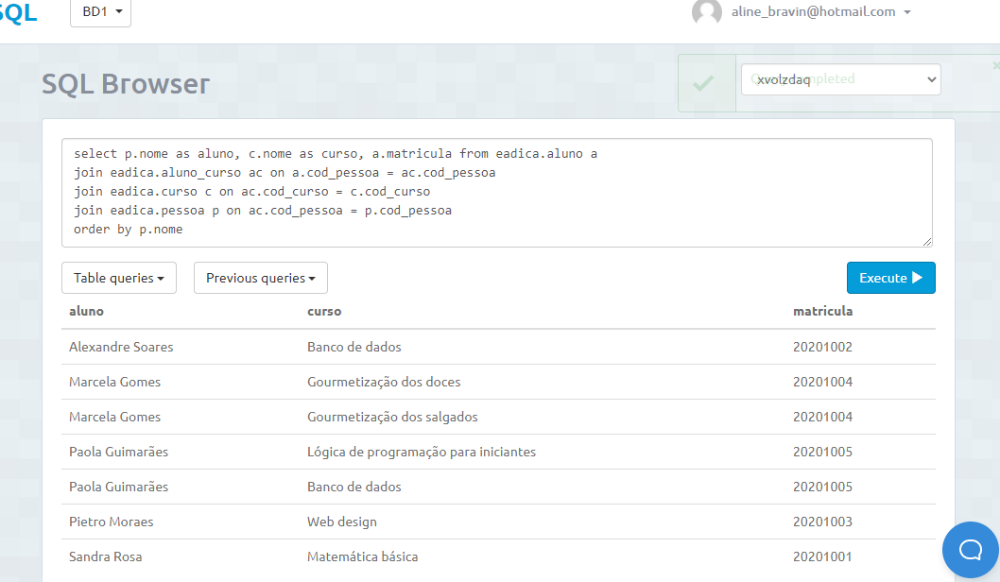

    select * from eadica.instrutor
    order by qtd_comissao desc
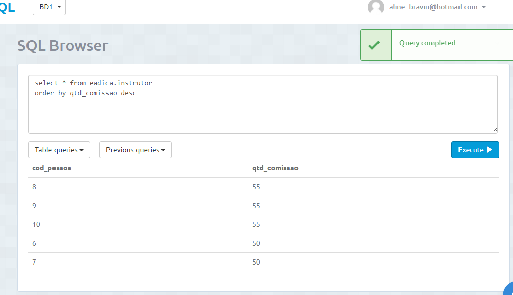

    select * from eadica.aluno_curso
    order by qtd_horas_assistidas desc
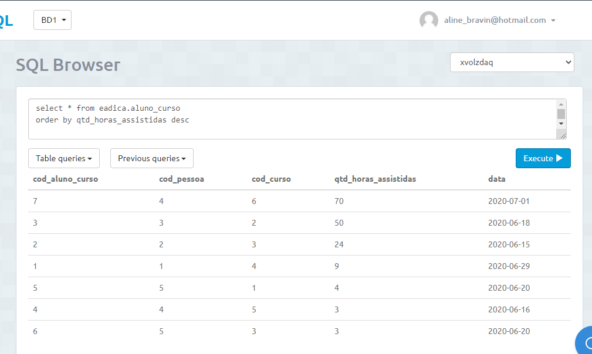

    select c.categoria, p.nome as aluno from eadica.aluno a
    join eadica.aluno_curso ac on a.cod_pessoa = ac.cod_pessoa
    join eadica.curso c on ac.cod_curso = c.cod_curso
    join eadica.pessoa p on p.cod_pessoa = a.cod_pessoa
    order by c.categoria
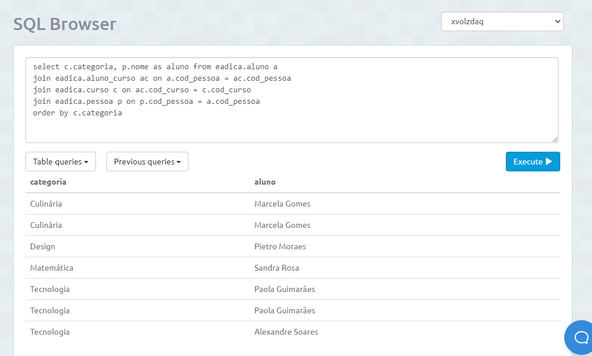

    select * from eadica.instrutor i
    join eadica.pessoa p on i.cod_pessoa = p.cod_pessoa
    order by cpf
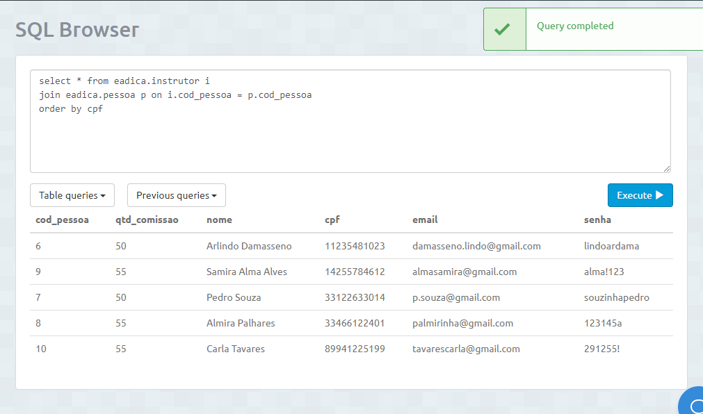

    select c.nome as curso, p.nome as instrutor from eadica.curso c
    join eadica.instrutor_curso ic on c.cod_curso = ic.cod_curso
    join eadica.pessoa p on p.cod_pessoa = ic.cod_pessoa
    order by c.nome
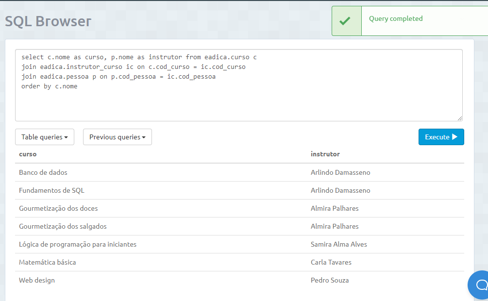

#### 9.7	CONSULTAS COM GROUP BY E FUNÇÕES DE AGRUPAMENTO (Mínimo 6) 
     a) Criar minimo 2 envolvendo algum tipo de junção
    
    select c.nome as nome_curso, count(*) as quantidade_alunos 
    from eadica.aluno_curso ac 
    join eadica.curso c on ac.cod_curso = c.cod_curso group by c.nome
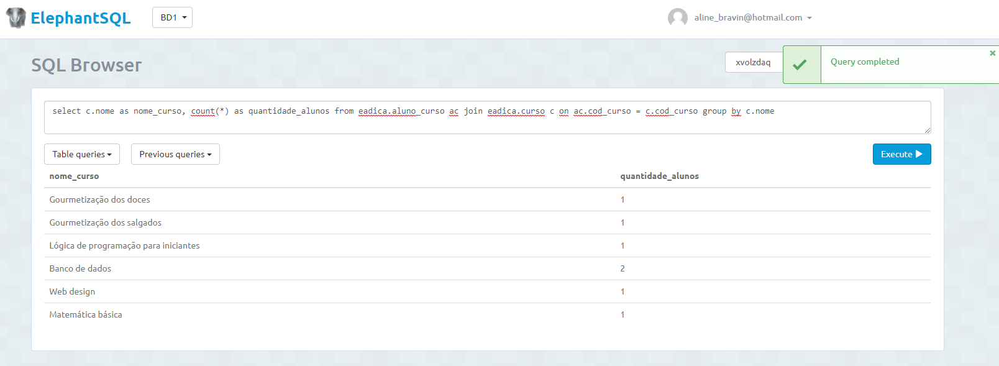

    select p.nome nome_aluno, a.matricula as matricula, count(*) as quantidade_cursos 
    from eadica.aluno_curso ac 
    join eadica.aluno a on a.cod_pessoa = ac.cod_pessoa 
    join eadica.pessoa p on p.cod_pessoa = a.cod_pessoa 
    group by a.matricula, p.nome ;
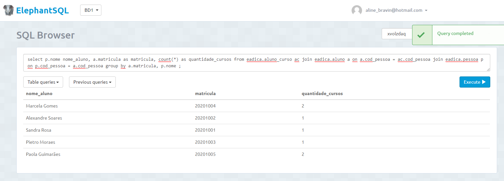
    
    select count(*) as Professores_Comissao_Maior_50 
    from eadica.instrutor i 
    where qtd_comissao > 50 
    group by qtd_comissao ;
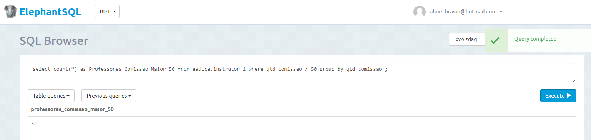

    select p.nome, count(*) 
    from eadica.instrutor_curso ic 
    join eadica.pessoa p on ic.cod_pessoa = p.cod_pessoa 
    where qtd_horas_ministradas > 80 
    group by p.cod_pessoa;
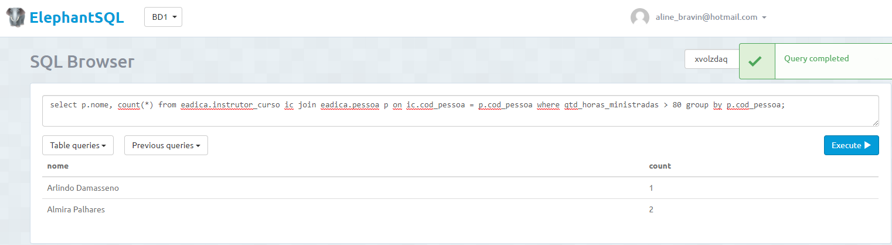

    select c.categoria, sum(qtd_horas_assistidas) as qtd_horas_assistidas 
    from eadica.aluno_curso ac 
    join eadica.curso c on ac.cod_curso = c.cod_curso
    group by c.categoria;
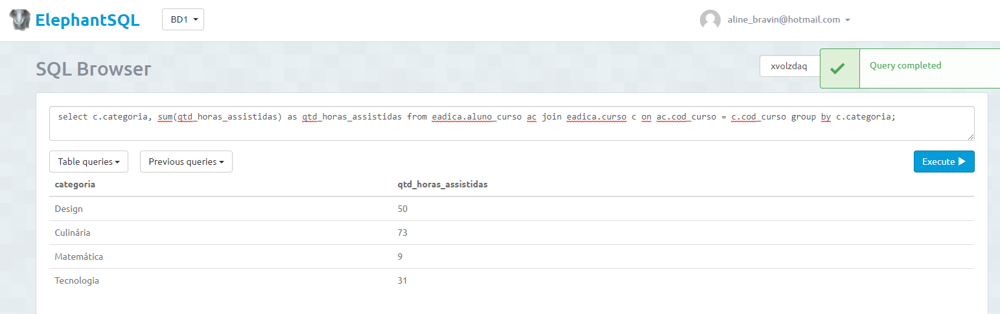
    
    select p.nome as aluno, sum(qtd_horas_assistidas) as qtd_horas_assistidas 
    from eadica.aluno_curso ac 
    join eadica.pessoa p on ac.cod_pessoa = p.cod_pessoa 
    join eadica.aluno a on a.cod_pessoa = p.cod_pessoa 
    group by p.nome;
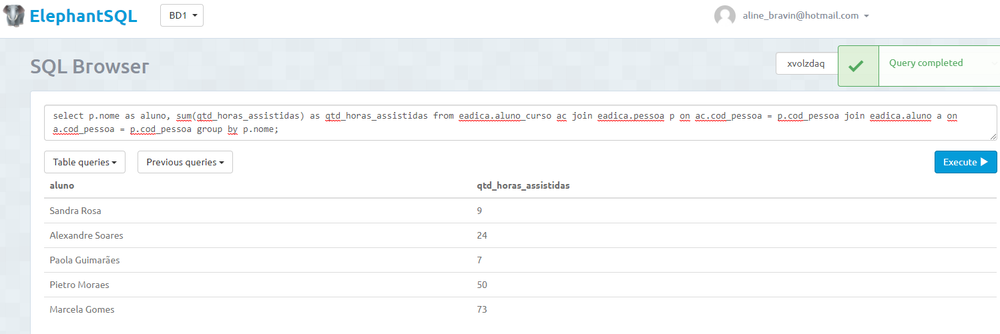
    
#### 9.8	CONSULTAS COM LEFT, RIGHT E FULL JOIN (Mínimo 4) 
    a) Criar minimo 1 de cada tipo
    
    select nome,email,matricula from eadica.aluno a
    left join eadica.aluno_curso ac on a.cod_pessoa = ac.cod_pessoa
    join eadica.pessoa p on a.cod_pessoa = p.cod_pessoa
    where ac.cod_pessoa is null

    select * from eadica.aluno a
    full join eadica.pessoa p on a.cod_pessoa = p.cod_pessoa
    order by p.cod_pessoa
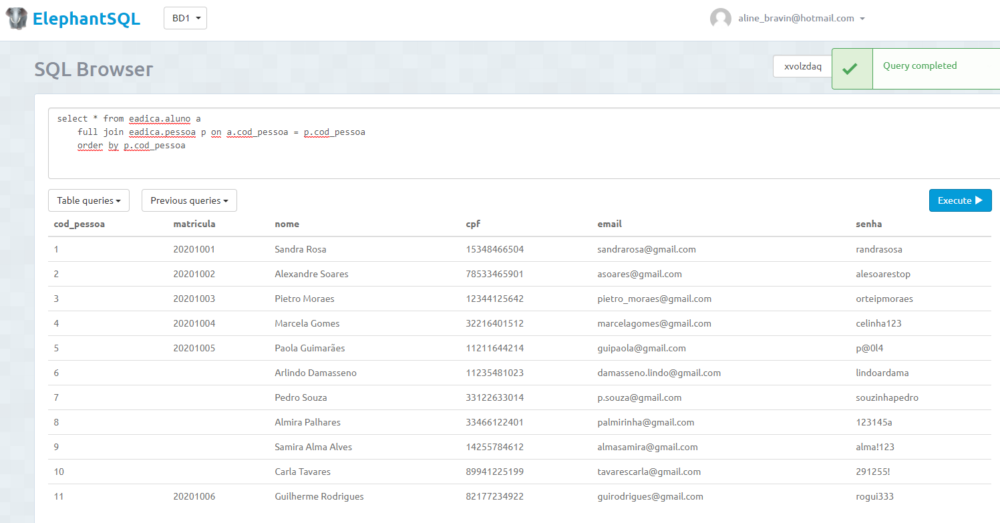

    select * from eadica.instrutor i
    full join eadica.pessoa p on i.cod_pessoa = p.cod_pessoa
    order by p.cod_pessoa
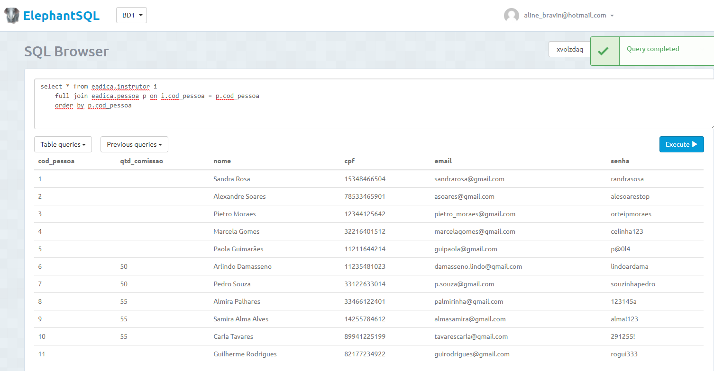

    select p.nome as instrutor, c.nome as curso from eadica.instrutor i
    right join eadica.instrutor_curso ic on i.cod_pessoa = ic.cod_pessoa
    join eadica.pessoa p on ic.cod_pessoa = p.cod_pessoa
    join eadica.curso c on ic.cod_curso = c.cod_curso
    where i.cod_pessoa is null
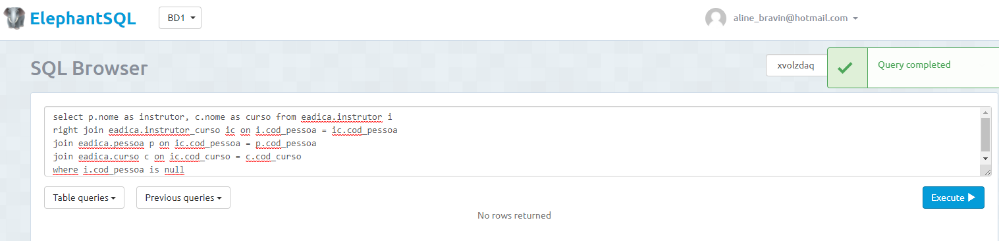

#### 9.9	CONSULTAS COM SELF JOIN E VIEW (Mínimo 6) 
        a) Uma junção que envolva Self Join (caso não ocorra na base justificar e substituir por uma view)
        b) Outras junções com views que o grupo considere como sendo de relevante importância para o trabalho
        
    select p.nome, a1.cod_curso from eadica.aluno_curso a1
    join eadica.aluno_curso a2 on a1.cod_pessoa <> a2.cod_pessoa and a1.cod_curso = a2.cod_curso
    join eadica.pessoa p on a1.cod_pessoa = p.cod_pessoa
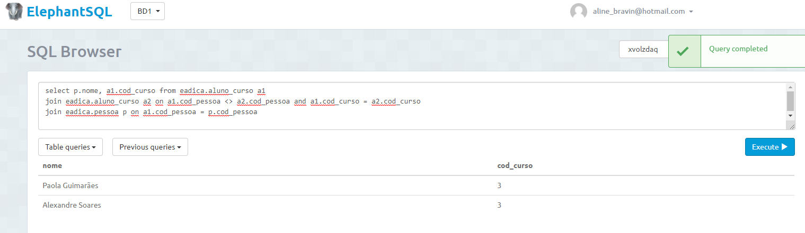

    create view alunos_horas as
    select nome as aluno, sum(qtd_horas_assistidas) total_horas from eadica.aluno_curso ac
    join eadica.pessoa p on ac.cod_pessoa = p.cod_pessoa
    group by p.cod_pessoa
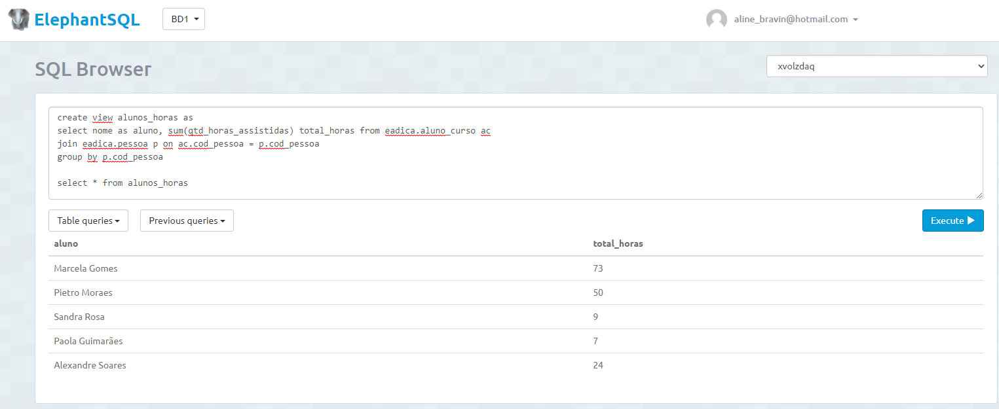

    create view categoria_horas as
    select categoria, sum(qtd_horas_assistidas) total_horas from eadica.aluno_curso ac
    join eadica.curso c on ac.cod_curso = c.cod_curso
    group by c.categoria
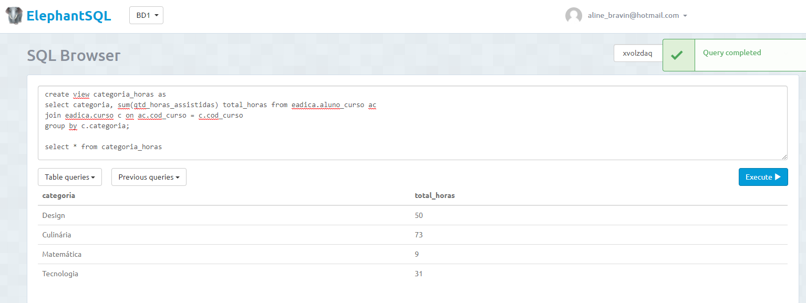

    create view categorias_horas_ministradas as
    select categoria, sum(qtd_horas_ministradas) total_horas from eadica.instrutor_curso ic
    join eadica.curso c on ic.cod_curso = c.cod_curso
    group by c.categoria;
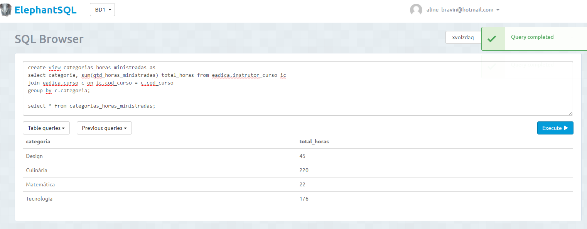

    create view alunos_por_curso as 
    select c.nome as nome_curso, count(*) as quantidade_alunos 
    from eadica.aluno_curso ac 
    join eadica.curso c on ac.cod_curso = c.cod_curso group by c.nome;
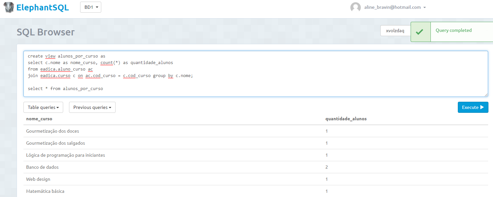

    create view qtd_cursos_por_aluno as
    select p.nome nome_aluno, a.matricula as matricula, count(*) as quantidade_cursos 
    from eadica.aluno_curso ac 
    join eadica.aluno a on a.cod_pessoa = ac.cod_pessoa 
    join eadica.pessoa p on p.cod_pessoa = a.cod_pessoa 
    group by a.matricula, p.nome ;
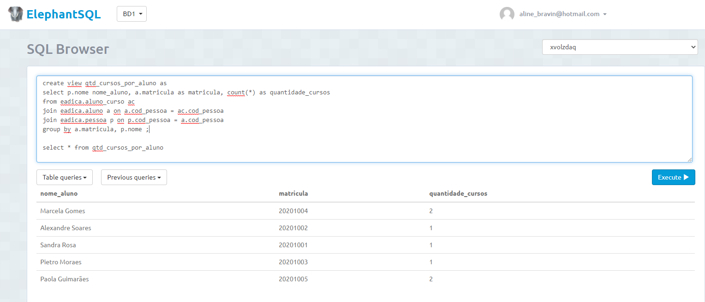

#### 9.10	SUBCONSULTAS (Mínimo 4) 
     a) Criar minimo 1 envolvendo GROUP BY
     b) Criar minimo 1 envolvendo algum tipo de junção

    select * from eadica.aluno_curso c
    where c.cod_curso in (select cod_curso from eadica.curso where categoria = 'Culinária')
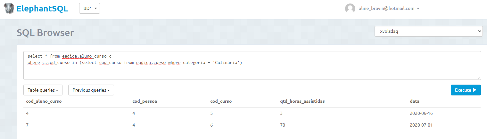

    select * from eadica.aluno
    where cod_pessoa in (select cod_pessoa from eadica.aluno_curso ac 
    join eadica.curso c on ac.cod_curso = c.cod_curso where c.nome = 'Web design')

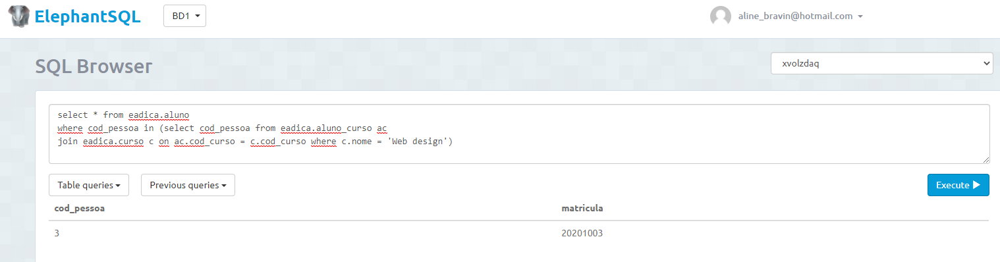

    select * from eadica.instrutor i
    join eadica.pessoa p on i.cod_pessoa = p.cod_pessoa
    where i.cod_pessoa in (select i.cod_pessoa from eadica.aluno_curso ac
    join eadica.curso c on ac.cod_curso = c.cod_curso
    join eadica.instrutor_curso ic on c.cod_curso = ic.cod_curso
    join eadica.instrutor i on ic.cod_pessoa = i.cod_pessoa
    where ac.cod_pessoa = 4
    )
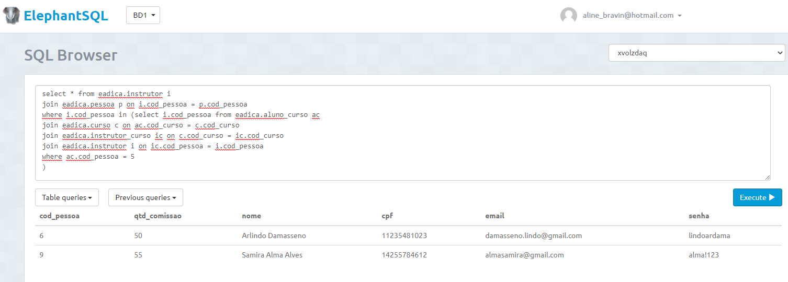
    
    select * from eadica.instrutor i
    join eadica.pessoa p on i.cod_pessoa = p.cod_pessoa
    where i.cod_pessoa in (select i.cod_pessoa from eadica.aluno_curso ac
    join eadica.curso c on ac.cod_curso = c.cod_curso
    join eadica.instrutor_curso ic on c.cod_curso = ic.cod_curso
    join eadica.instrutor i on ic.cod_pessoa = i.cod_pessoa
    join eadica.pessoa p on ac.cod_pessoa = p.cod_pessoa
    where p.nome like 'Marcela%'
    )
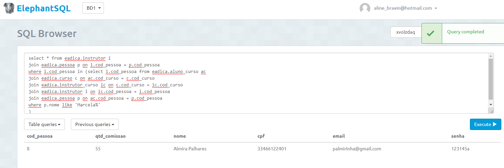

># Marco de Entrega 02: Do item 9.2 até o ítem 9.10 

### 10 RELATÓRIOS E GRÁFICOS

#### a) análises e resultados provenientes do banco de dados desenvolvido (usar modelo disponível)
#### b) link com exemplo de relatórios será disponiblizado pelo professor no AVA
#### OBS: Esta é uma atividade de grande relevância no contexto do trabalho. Mantenha o foco nos 5 principais relatórios/resultados visando obter o melhor resultado possível.

    

### 11	AJUSTES DA DOCUMENTAÇÃO, CRIAÇÃO DOS SLIDES E VÍDEO PARA APRESENTAÇAO FINAL  

#### a) Modelo (pecha kucha) 
#### b) Tempo de apresentação 6:40 

># Marco de Entrega 03: Itens 10 e 11 
 
 
  

### 12 FORMATACAO NO GIT:  
https://help.github.com/articles/basic-writing-and-formatting-syntax/
<comentario no git>
    
##### About Formatting
    https://help.github.com/articles/about-writing-and-formatting-on-github/
    
##### Basic Formatting in Git
    
    https://help.github.com/articles/basic-writing-and-formatting-syntax/#referencing-issues-and-pull-requests
    
    
##### Working with advanced formatting
    https://help.github.com/articles/working-with-advanced-formatting/
#### Mastering Markdown
    https://guides.github.com/features/mastering-markdown/

    
### OBSERVAÇÕES IMPORTANTES

#### Todos os arquivos que fazem parte do projeto (Imagens, pdfs, arquivos fonte, etc..), devem estar presentes no GIT. Os arquivos do projeto vigente não devem ser armazenados em quaisquer outras plataformas.
1. <strong>Caso existam arquivos com conteúdos sigilosos<strong>, comunicar o professor que definirá em conjunto com o grupo a melhor forma de armazenamento do arquivo.

#### Todos os grupos deverão fazer Fork deste repositório e dar permissões administrativas ao usuário do git "profmoisesomena", para acompanhamento do trabalho.

#### Os usuários criados no GIT devem possuir o nome de identificação do aluno (não serão aceitos nomes como Eu123, meuprojeto, pro456, etc). Em caso de dúvida comunicar o professor.

Link para BrModelo: 
http://www.sis4.com/brModelo/download.html
 

Link para curso de GIT 

